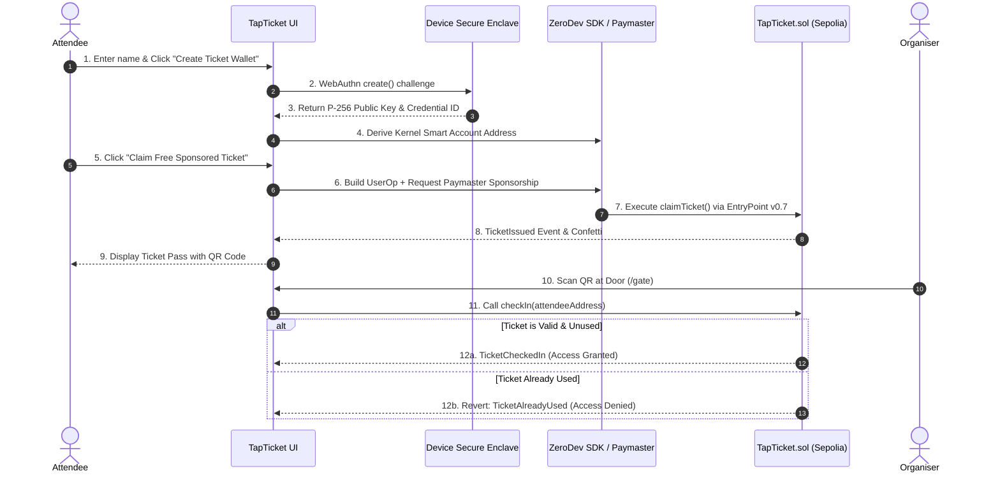

# ROAD TO DEVCON – IIITN EDITION

## TapTicket

### Built At

**Ethereum Research Workshop & Builders Lab**  
**IIIT Nagpur × Bhaisaaab**  
*August 30-31, 2026*

---

### Project Overview

**TapTicket** removes the two critical failure points in event ticketing at student-run tech events and hackathons:
1. **Attendee Friction**: Forcing students to install browser extensions or mobile wallet apps, write down 12-word seed phrases, and beg for testnet ETH before claiming a ticket.
2. **Organiser Chaos**: Running gate check-in off a shared Google Form while eyeballing a spreadsheet at the door, vulnerable to duplicate entries and counterfeit passes.

With TapTicket:
- An attendee logs in with their device **Passkey** (Touch ID, Face ID, or Windows Hello) in under 5 seconds.
- A **ZeroDev Kernel Smart Account (ERC-4337)** is deterministically created for them behind the scenes.
- The attendee claims their ticket via a **Sponsored UserOperation** where the **ZeroDev Paymaster** pays the gas fee ($0 cost for the student).
- At the door, the organiser scans the attendee's Smart Account QR code to trigger `checkIn(attendee)` on-chain, permanently marking the pass used and autonomously rejecting duplicate entries.

> **Account Abstraction is not decorative here**: it is the exact technical reason someone with zero crypto experience can claim a verified on-chain ticket in under 30 seconds, and why the organiser does not have to manually fund every attendee with gas.

---

### The Problem

Traditional event ticketing at campus hackathons and community Ethereum meetups faces severe bottlenecks:

* **High Onboarding Drop-off**: 80%+ of first-time attendees give up when told to install MetaMask, configure custom RPC networks, and obtain testnet faucet ETH.
* **Gatekeeper Human Error**: Paper lists and Google Spreadsheets are prone to cell overwrites, duplicate scans, and zero cryptographic auditability.
* **Organiser Gas Overhead**: If organisers try to distribute on-chain passes traditionally, they either have to fund hundreds of individual EOAs with gas or build complex centralized custodial backends.

---

### The Solution

TapTicket delivers a web2-grade user experience backed by Ethereum security:

1. **WebAuthn Passkey Authentication**: Attendees sign with hardware-backed P-256 keys generated in their device's Secure Enclave / TPM. No private key exports or seed phrase backups needed.
2. **ERC-4337 Kernel Smart Accounts**: Each attendee receives a modular smart contract account (ZeroDev Kernel v3) as their decentralized identity.
3. **Paymaster Gas Sponsorship**: Organisers sponsor user operations through the ZeroDev Paymaster, providing true gas abstraction.
4. **On-Chain Gate Enforcement**: Minimal, plain-mapping Solidity contract (`TapTicket.sol`) enforces single-use tickets directly on Ethereum Sepolia testnet.

---

### Why Account Abstraction?

Programmable accounts solve the fundamental usability dilemmas of Ethereum:

* **Separation of Signer and Account**: The attendee's device biometrics (Passkey) act as the validator/signer, while the Smart Account is an autonomous contract identity on-chain.
* **Gas Abstraction**: EOA accounts cannot execute transactions without native ETH. ERC-4337 Smart Accounts delegate gas payment to a Paymaster via `validatePaymasterUserOp`.
* **Bundler Execution**: Transactions are submitted as `UserOperation` structs, batched, and executed through canonical EntryPoint v0.7 without requiring user RPC configuration.

---

### Key Features

* ⚡ **1-Click Passkey Ticket Wallet**: WebAuthn P-256 registration via Touch ID, Face ID, or Windows Hello.
* 🎟️ **Instant Sponsored Ticket Claim**: Paymaster-sponsored UserOp execution in 1 click.
* 📱 **Apple Wallet Style Pass**: Dynamic QR code encoding attendee Smart Account address and cryptographic proof.
* 🚪 **Organiser Door Scanner**: Live camera QR scanner and instant tap verification.
* 🛡️ **Autonomous Duplicate Rejection**: Smart contract rejects reused tickets with detailed timestamps.
* 🔍 **ERC-4337 UserOp Inspector Drawer**: Educational modal showing raw `PackedUserOperation`, EntryPoint v0.7, Paymaster payload, and Sepolia transaction hash.
* 💡 **Seamless Demo Mode**: Reliable toggle for presentations in environments without live testnet connectivity or WebAuthn hardware.

---

### ERC-4337 / Smart Account Architecture

```mermaid
flowchart LR
    subgraph AttendeeDevice ["Attendee Device"]
        Passkey["Passkey Signer\n(WebAuthn P-256)"]
        UI["TapTicket Web App\n(Next.js + Viem)"]
    end

    subgraph AAInfrastructure ["ERC-4337 Infrastructure"]
        UserOp["UserOperation\n(claimTicket)"]
        Bundler["ZeroDev Bundler RPC"]
        Paymaster["ZeroDev Paymaster\n(Gas Sponsorship)"]
        EntryPoint["EntryPoint v0.7\n0x0000...7172"]
    end

    subgraph OnChain ["Ethereum Sepolia Testnet"]
        SmartAccount["Kernel v3 Smart Account\n(Attendee Address)"]
        Contract["TapTicket.sol\n(Plain Mappings)"]
    end

    Passkey -->|Signs UserOp| UI
    UI -->|Dispatches UserOp| UserOp
    UserOp --> Bundler
    Paymaster -->|Sponsors Gas| Bundler
    Bundler -->|Submits Bundle| EntryPoint
    EntryPoint -->|Executes UserOp| SmartAccount
    SmartAccount -->|Calls claimTicket()| Contract
```

---

### User Flow



---

### Tech Stack

* **Frontend**: Next.js 14 (App Router), React 18, TypeScript, Tailwind CSS, Lucide Icons, Canvas Confetti
* **Ethereum & Web3**: Viem 2.x, Permissionless
* **Account Abstraction**: ZeroDev SDK v5.5 (`@zerodev/sdk`), ZeroDev Passkey Validator (`@zerodev/passkey-validator`), Kernel v3 Smart Accounts, ERC-4337 EntryPoint v0.7
* **Smart Contracts**: Solidity 0.8.20 (Plain Mappings, Custom Errors, Gas-Optimized)
* **Testnet**: Ethereum Sepolia
* **QR Tooling**: `qrcode.react`, `html5-qrcode`

---

### Project Structure

```
tapticket/
├── contracts/
│   └── TapTicket.sol             # Plain-mapping ticket contract (claimTicket, checkIn, hasValidTicket)
├── src/
│   ├── app/
│   │   ├── api/
│   │   │   ├── checkin/route.ts   # Gatekeeper check-in verification API
│   │   │   └── event/route.ts     # Live event stats endpoint
│   │   ├── gate/page.tsx          # Organiser Gatekeeper Station & QR Door Scanner
│   │   ├── ticket/page.tsx        # Attendee Standalone Ticket Pass
│   │   ├── globals.css            # Dark theme, glow badges, perforated ticket styles
│   │   ├── layout.tsx             # Root layout with Devcon branding & footer
│   │   └── page.tsx               # Attendee 1-Click Passkey Onboarding & Demo
│   ├── components/
│   │   ├── AttendeePasskeyCard.tsx # 1-Click Passkey creation & sponsored claim
│   │   ├── GateScanner.tsx        # Camera QR scanner + quick tap gatekeeper
│   │   ├── HeroSection.tsx        # Problem vs solution breakdown
│   │   ├── Navbar.tsx             # Header navigation + ZeroDev Paymaster badge
│   │   ├── StatsCounter.tsx       # Live attendee metrics & gas saved counter
│   │   ├── TicketPassView.tsx     # Apple Wallet style pass with QR code
│   │   └── UserOpInspectorModal.tsx # ERC-4337 UserOp payload & EntryPoint drawer
│   ├── config/
│   │   ├── chains.ts              # Sepolia chain & EntryPoint v0.7 addresses
│   │   └── contracts.ts           # TapTicket ABI & default event constants
│   ├── lib/
│   │   ├── passkey.ts             # WebAuthn helper functions
│   │   ├── simulatedAA.ts         # Fast presentation Demo Mode engine
│   │   ├── ticketContract.ts      # Viem contract read/write helpers
│   │   ├── utils.ts               # Formatting, addresses, and styles
│   │   └── zerodev.ts             # ZeroDev Kernel, Passkey validator, and Paymaster client
│   └── types/
│       └── index.ts               # Smart Account, Ticket, and UserOp TypeScript types
├── .env.example                   # Documented configuration variables
├── ARCHITECTURE.md                # In-depth architectural rationale
├── DEMO.md                        # 2-minute pitch script & presentation guide
├── PITCH.md                       # Comprehensive hackathon presentation brief
└── package.json
```

---

### Getting Started

#### 1. Clone the repository
```bash
git clone https://github.com/sarthak3111/tapticket.git
cd tapticket
```

#### 2. Install dependencies
```bash
npm install
```

#### 3. Configure environment variables
```bash
cp .env.example .env.local
```

#### 4. Run the development server
```bash
npm run dev
```
Open [http://localhost:3000](http://localhost:3000) in your browser.

---

### Environment Variables

| Variable | Description | Default / Example |
| :--- | :--- | :--- |
| `NEXT_PUBLIC_ZERODEV_PROJECT_ID` | ZeroDev Project ID for Sepolia (from [ZeroDev Dashboard](https://dashboard.zerodev.app)) | `your_zerodev_project_id_here` |
| `NEXT_PUBLIC_TICKET_CONTRACT_ADDRESS` | Deployed TapTicket contract address on Sepolia | `0x94fC49aE5779c13fe6F0a5814529FE5d81bFFe37` |
| `NEXT_PUBLIC_RPC_URL` | Ethereum Sepolia RPC endpoint | `https://ethereum-sepolia-rpc.publicnode.com` |
| `NEXT_PUBLIC_CHAIN_ID` | Chain ID (Sepolia: 11155111) | `11155111` |
| `ORGANISER_PRIVATE_KEY` | *(Optional)* Organiser signer key for automated on-chain gate check-ins | `0x...` |

*(Note: TapTicket includes a built-in Demo Mode fallback that functions seamlessly even without external API keys).*

---

### Smart Contracts

* **Contract Name**: `TapTicket`
* **File**: `contracts/TapTicket.sol`
* **Network**: Ethereum Sepolia Testnet
* **Data Model**: Plain Solidity mappings (`mapping(address => bool) public hasValidTicket; mapping(address => bool) public isUsed;`). No ERC-721, no IPFS, no metadata overhead.
* **Core Functions**:
  - `claimTicket()`: Called by attendee Kernel Smart Account (sponsored by Paymaster).
  - `issueTicket(address attendee)`: Called by organiser.
  - `checkIn(address attendee)`: Called by organiser at the door to validate and mark ticket used.
  - `getTicketStatus(address attendee)`: Returns `(bool hasTicket, bool used, uint256 issuedTime, uint256 checkInTime)`.

---

### Account Abstraction Features Implemented

1. **Passkey WebAuthn Validator**: Replaces ECDSA private keys with P-256 hardware credentials.
2. **ZeroDev Kernel v3 Smart Accounts**: Modular ERC-4337 account contract providing counterfactual address generation.
3. **Paymaster Gas Sponsorship**: Complete gas abstraction for ticket claiming.
4. **UserOperation Transparency**: Real-time inspection of UserOp calldata, nonce, EntryPoint, and bundler status.

---

### Demo Flow (Step-by-Step)

1. **Open Attendee Portal** (`/`): Enter your name and click **"Create Passkey Ticket Wallet (1-Click)"**. Authenticate with Touch ID / Face ID / Windows Hello.
2. **Claim Sponsored Pass**: Click **"Claim Free Ticket (Sponsored UserOp)"**. The ZeroDev Paymaster sponsors gas, and your verified QR ticket pass appears with confetti.
3. **Inspect the UserOp**: Click **"Inspect UserOp"** on the ticket to view the raw ERC-4337 payload and EntryPoint v0.7 execution.
4. **Gate Verification** (`/gate`): Open the Organiser Gate Station. Scan the attendee QR code or click **"Current Registered Pass"**.
5. **Observe Verification**:
   - 🟢 First scan: **ACCESS GRANTED** (Ticket marked used on-chain).
   - 🔴 Second scan: **ENTRY DENIED: ALREADY CHECKED IN** (Double entry blocked on-chain).

---

### Future Improvements

* **Session Keys for Gate Staff**: Allow event volunteers to check in attendees using temporary session keys with restricted permissions and expiration timestamps.
* **Batch Ticket Issuance**: Organiser transaction batching to issue 50+ tickets in a single UserOperation.
* **Multi-Event Support**: Modular factory deploying lightweight event instances per student club.

---

### Security Considerations

* **Hardware Security**: Passkey private keys never leave the attendee's device enclave.
* **Replay Protection**: The `TapTicket.sol` contract enforces strict state transitions (`isUsed = true`), preventing replay attacks.
* **Gas Sponsorship Policies**: Paymasters should implement rate-limiting or allowlist policies in production to prevent spam.

---

### Privacy Considerations

* Account Abstraction decouples the physical hardware signer from the on-chain Smart Account.
* The contract stores only addresses and boolean states without storing personal PII on-chain.

---

### Built During

**ROAD TO DEVCON – IIITN EDITION**  
**Ethereum Research Workshop & Builders Lab**  
**IIIT Nagpur × Bhaisaaab**  
*August 30-31, 2026*
